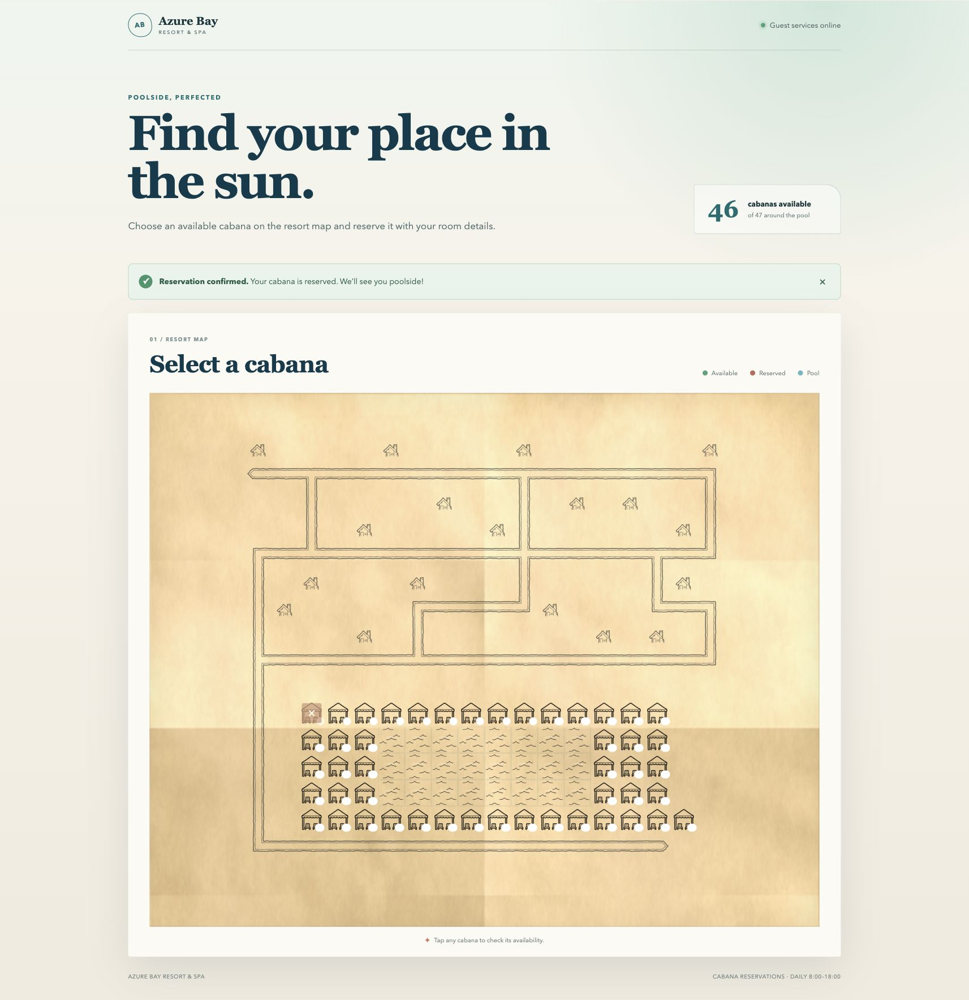

# Azure Bay Resort Map

An interactive resort map where current guests can view live cabana availability and reserve a poolside spot. The application is written in TypeScript with React, Vite, and Express. The browser gets all map and reservation data from the REST API; successful bookings are held in server memory for the life of the process.



## Run the app

Requirements: Node.js 20.19 or newer and npm.

```bash
npm install
npm start
```

Open [http://localhost:3000](http://localhost:3000). To try a reservation with the example data, use room `101` and guest name `Alice Smith`.

`npm start` is the single production entrypoint: it builds the frontend and starts the API and web server together. It accepts alternative input files as required:

```bash
npm start -- --map ./map.ascii --bookings ./bookings.json
```

Optional `--port <number>` changes the default port. Run `npm start -- --help` for all options. For development with hot reload, use `npm run dev -- --map <path> --bookings <path>`.

## Tests

```bash
npm test
```

The test suite covers:

- ASCII map and guest-file validation
- valid, invalid, and duplicate booking behavior
- REST map and booking responses
- immediate availability updates after a booking
- available, reserved, successful, and rejected UI flows

Run `npm run build` separately to perform a TypeScript check and production frontend build.

## API

| Method | Route | Purpose |
| --- | --- | --- |
| `GET` | `/api/map` | Return the typed map tiles and availability summary |
| `POST` | `/api/cabanas/:cabanaId/bookings` | Validate a guest and reserve an available cabana |

The booking body is `{ "room": "101", "guestName": "Alice Smith" }`. Errors use an appropriate HTTP status and a short `{ "message": "..." }` response.

## Input files

The map is a rectangular ASCII file containing `W` (cabana), `p` (pool), `#` (path), `c` (chalet), and `.` (empty space). The bookings file is a JSON array of current guests:

```json
[
  { "room": "101", "guestName": "Alice Smith" }
]
```

Invalid files fail at startup with a human-readable explanation.

## Design decisions and trade-offs

The application uses one small Express process for the API and built React client, which makes the reviewer entrypoint simple and avoids cross-origin configuration. Domain logic is kept in `Resort`, separate from HTTP handlers, while shared API types keep the frontend and backend aligned. Coordinate-based cabana IDs remain stable for a given map, and the UI renders every tile directly from the API response.

Reservations intentionally use an in-memory `Set`, as persistence and authentication are outside the task. Guest names are matched case-insensitively after trimming, while room numbers must match exactly. I kept the flow on one screen: the booking dialog closes after success, the chosen cabana changes state immediately, and an accessible confirmation appears above the map. The visual map uses the supplied tile artwork and CSS rather than adding a mapping or canvas dependency.

See [AI.md](./AI.md) for the AI-assisted workflow used to produce this solution.
